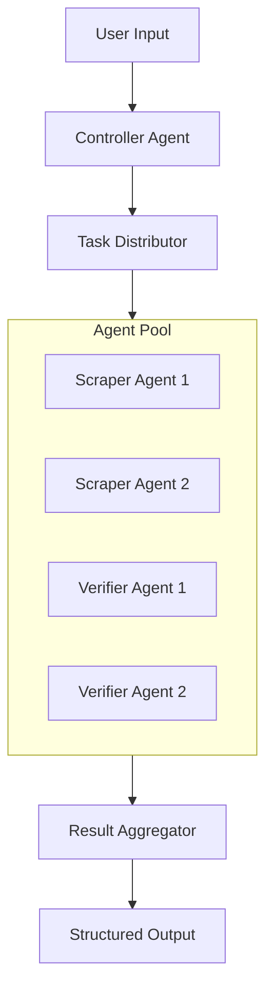
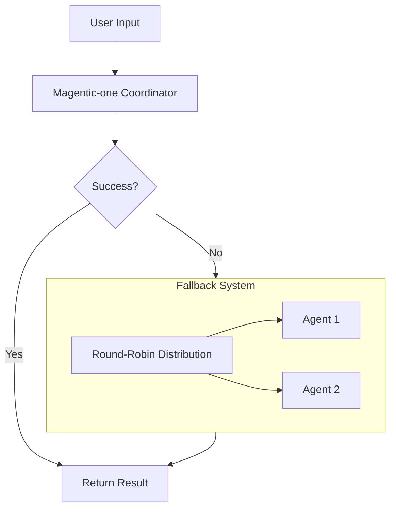
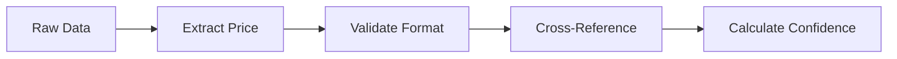
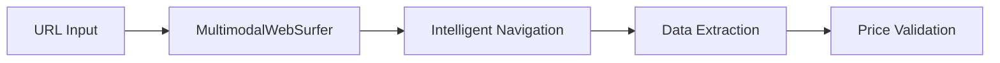

# System Patterns

## Architecture Overview

## Design Patterns

### 1. Agent Coordination Strategy

### 2. Round-Robin Task Distribution
- Balanced workload across agents
- Fair resource allocation
- Optimal task processing

### 3. Multi-Agent Collaboration
- Specialized agent roles
- Clear communication protocols
- Defined interaction patterns

### 4. Verification Pipeline

### 5. Cost Tracking System
- Per-agent cost monitoring
- Resource usage tracking
- Performance optimization metrics

## Component Relationships

### Primary Coordinator
- Uses Magentic-one with Gemini-2.0-Flash model
- Handles main task processing through multimodal capabilities
- Monitors success rate and model performance
- Triggers fallback system when needed
- Optimizes model parameters based on task requirements

### Fallback Controller Agent
- Manages overall workflow
- Coordinates between components
- Handles error scenarios

### Task Distributor
- Implements round-robin scheduling
- Balances agent workload
- Tracks task status

### Scraper Agents
- Extract pricing data using MultimodalWebSurfer
- Handle different website formats with advanced web interactions
- Process raw information with enhanced capabilities
- Support for JavaScript-rendered content
- Intelligent navigation and data extraction

### WebSurfer Integration

### Verifier Agents
- Cross-reference pricing
- Validate data accuracy
- Calculate confidence scores

### Result Aggregator
- Combines agent outputs
- Formats final response
- Ensures data consistency

## Error Handling
1. Retry mechanisms for failed requests
2. Graceful degradation
3. Comprehensive error reporting
4. Recovery procedures

## Performance Patterns
1. Parallel processing where possible
2. Efficient resource utilization through Magentic-one
3. Intelligent caching strategies
4. Dynamic load balancing
5. Enhanced agent coordination
   - Magentic-one powered interactions with Gemini model
   - Optimized task distribution based on model capabilities
   - Smart resource allocation considering API quotas
6. Model Optimization
   - Parameter tuning for specific tasks
   - Response caching for similar queries
   - Batch processing when appropriate

## Security Patterns
1. Input validation
2. Rate limiting
3. Error masking
4. Secure data handling
